[toc]


# 1、快速上手

预处理指令：

```c
#include<stdio.h>
#include<stdlib.h>
#include<string.h>
#define MAX_COLS 20
#define MAX_INPUT 1000
```

这些指令由预处理器解释，预处理器读入源代码，根据预处理指令对其进行<u>修改</u>，然后把修改过的源代码递交给编译器。

用#define定义的常量一般用大写加以区分，且该变量不能被赋值。

当预处理语句过多时，可以把它们打包到一个自定义头文件中，然后直接引用该头文件即可，这样还能避免由于同一个声明的多份拷贝而导致的维护性问题。

```C
/*
*  读取、处理和打印剩余的输入行
*/
while (gets(input)!=NULL){
    printf("Original input : $s\n",input);
    rearrange(output, input, n_columns,columns);
    printf("Rearranged line: %s\n", output);
}
```

要多在代码中写进必要的注释，以此来解释清楚什么地方的代码是什么功能，这样过一段时间后别人(或自己)重看一遍这部分代码会很容易理解，更有利于维护。同时，更新代码时也要注意相关注释的更新。


```C
/*
* 读取列标号，如果超出规定范围则不予理会
*/
int read_column_numbers(int columns[],int max);
```

声明的数组不用附带长度，这种特性允许函数操纵任意长度的一维数组， 缺点就是不能获取数组的长度。

```C
ch=getchar();
while(ch!=EOF && ch!='\n')   //EOF 本质上是个整数值
    ch=getchar();
```

这块代码用于一个个读取字符直至到达文件末尾（或者读到换行符）。


```C
/*
*  处理输入行，将指定列的字符连接在一起，输出行以NULL结尾
*/
void rearrange(char *output,char const *input,
              int n_columns,int const columns[])
```

数组本质上就是指针，因此传入的参数不是数组的备份而是指针，也就是说，在函数内对数组参数的修改会影响函数外部的实际数组。为了避免修改数组，可以将参数声明为 const 。


## 警告与总结

1.在scanf函数的标量参数前未添加&字符。

2.机械的把printf函数的格式代码照搬于scanf函数。

3.在应该使用&&操作符的地方误用了&操作符。

4.误用=操作符而不是==操作符来测试相等性。

## 编程提示的总结

1.使用#include指令避免重复声明

2.使用#define指令给常量值取名。

3.在#include文件中放置函数原型。

4.在使用下标前先检查它们的值。

5.在while或if表达式中蕴含赋值操作。

6.如何编写一个空循环体。

7.始终要进行检查，去日报数组不越界。


# 2、基本概念

## 2.1 环境

### 2.1.1 翻译环境

翻译阶段，一个(或多个)源文件(Source code)通过编译(Complier)过程分别转换为目标代码(Object code)。然后，这些目标代码由链接器(linker)捆绑在一起，形成一个可执行(executable)程序。

编译过程：

​	1.预处理器处理。预处理在源代码上执行一些文本操作。如：用实际值代替#define等命令，读入#include包含的文件。

​	2.解析，判断语句的意思。随后产生目标代码(机器指令的初步形式，用于实现程序的语句)。   如果我们在编译程序的命令行中假如了要求进行优化的选项，优化器(optimizer)可以进一步处理目标代码，使其效率更高(优化过程更耗时间)。

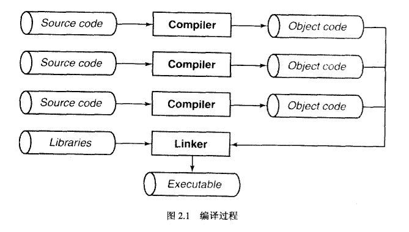

下面以UNIX为例进行编译和链接

```C
//1、编译并连接一个完全包含于一个源文件的C程序
cc program.c
//会产生一个a.cout可执行程序。中间会产生program.o目标文件,不
//过它在连接过程完成后会被删除。

//2、编译并链接几个C源文件
cc main.c sort.c lookup.c
//当编译的源文件超过一个时，目标文件不会被删除

//3、编译一个C源文件，并把它和现存的目标文件链接在一起
cc main.o lookup.o sort.c

//4、编译单个C源文件，并产生一个目标文件，以后再进行链接
cc -c program.c

//5、编译几个C源文件，并为每个文件产生一个目标文件
cc -c main.c sort.c lookup.c

//6、链接几个目标文件
cc main.o sort.o lookup.o
```

### 2.1.2 执行环境

执行过程：

​	1.程序被载入到内存中（由操作系统完成）。哪些不存储在堆栈中的尚未初始化的变量将会初始化。

​	2.通过一个小型启动程序和目标程序链接在一起。然后调用main函数。

​	3.程序会使用一个运行时**堆栈**，它用于存储函数的局部变量和返回地址。   同时程序也会使用**静态**内存，其中的变量在整个过程中会一直保留原本的值。

​	4.程序结束。可以是末尾return 0；正常结束，也可以是中途报错直接结束。

## 2.2 词法规则

### 三字母词

通过??x的形式可以转义出其他符号，部分样例如下表

| ??(  | [    |      | ??<  | {    |      | ??=  | #    |
| ---- | ---- | ---- | ---- | ---- | ---- | ---- | ---- |
| ??)  | ]    |      | ??>  | }    |      | ??/  | \    |
| ??!  | \|   |      | ??'  | ^    |      | ??-  | ~    |

现在转义一般用 ‘ \ ’。三字母词平时其实非常少见。

# 3、数据

## 3.1 基本数据类型

### 3.1.1 整型

#### 整型字面值

字面值如 1，2，FF这些数值，它们本身不能再改变。

变量的最小范围

| 类型               | 最小范围               |
| ------------------ | ---------------------- |
| char               | 0-127                  |
| signed char        | -127-127               |
| unsigned char      | 0-255                  |
| short int          | -32767-32767           |
| unsigned short int | 0-65535                |
| int                | -32767-32767           |
| unsigned int       | 0-65535                |
| long int           | -2147483647-2147483647 |
| unsigned long int  | 0-4294967295           |


头文件limits.h说明了各种不同的整数类型的特点。

如：CHAR_BIT 是字符型的位数，CHAR_MIN、CHAR_MAX定义了缺省字符类型的范围。 MB_LEN_MAX规定了一个多字节字符最多允许的字符数量。

|        | signed    | signed    | unsigned  |
| ------ | --------- | --------- | --------- |
| 类型   | 最小值    | 最大值    | 最大值    |
| 字符   | SCHAR_MIN | SCHAR_MAX | UCHAR_MAX |
| 短整型 | SHRT_MIN  | SHRT_MAX  | USHRT_MAX |
| 整型   | INT_MIN   | INT_MAX   | UNIT_MAX  |
| 长整型 | LONG_MIN  | LONG_MAX  | ULONG_MAX |

事实上，不同的机器中char可能有不同范围的值。

#### 枚举类型(enumerated)

```c
enum Jar_Type{CUP=8,PINT=16,QUART=32,
			HALF_GALLON=64,GALLON=128};
```

上例中，Jar_Type被声明为一个枚举类型，CUP、PINT等为符号常量，后续可以直接引用。

假如没有设置CUP、PINT等符号等于什么值，那么默认CUP=0、PINT=1 以此类推。

假如有的符号有设置值，而有的没有，那未设置值的符号，默认比前一个符号大1。

### 3.1.2 浮点类型

头文件float.h 定义了名字FLT_MAX、DBL_MAX和LDBL_MIN，分别表示float、double和long double所能存储的最大值。对应的xxx_MIN存最小值。

### 3.1.3 指针

#### 指针常量

每次调用一个函数时，它的局部变量可能每次分配的内存位置都不一样。

#### 字符串常量

定义：一串以NULL字节结尾的零个或多个字符。存入字符数组中。

## 3.2声明

### 3.2.2数组声明

C编译器不会检查数组下标是否越界。

如果下标值是从那些已知是正确的值 (比如直接声明a[100]) 计算得来的，就不用检查它的值。如果是其他方法或者用户输入得到的 (比如a[n]，这里的n可以计算得出，也可以用户输入) , 就需要检查它的值防止越界。

### 3.2.3 指针声明

```C
//声明一个指针
int *a;
//声明多个指针
int *b,*c,*d;
//字符串
char *message="Hello world!";
//上一句的具体过程
char *message;
message="Hello world!";
```

### 3.2.4隐式声明

```C
f(x){
	return x+1;
}
//编译器会默认f返回整型
```

隐式声明建议不用，很容易降低代码可读性。

## 3.3 typedef

typedef的目的：为各种数据类型定义新名字。

```C
typedef char *ptr_tp_char;
ptr_to_char a;   //等价于char *a;
```

定义类型名最好用typedef而不是用#define，后者无法正确地处理指针类型。

## 3.4 常量

```C
int const *p;   //等价于int *const p;
//该指针所指向的内容可以修改，但是不能修改地址。
const int *p;
//该指针可以修改地址，但不能修改所指向的值
const int *const p;
//该指针一初始化就不能修改。

//一般常量声明
#define MAX_ELEMENTS 50
int const max_elements=50;
```

定义一个名字常量的好处在于，后续维护程序时，只用修改声明部分就能修改所有相关的地方。

## 3.6 链接属性

连接属性分类：external(外部)、internal(内部)、none(无)

```C
extern int k;
//声明为extern的k将是外部文件的一个同名变量

static int b;
//声明为static的b将为当前的源文件私有
//在其他源文件中，若链接到一个叫做b的变量，那么它引用的将
//是另一个不同的变量

//对函数也可以如此声明，这样可以防止外部文件的调用。
static int f(int x);
```

## 3.7 存储类型

分类：普通内存、运行时堆栈、硬件寄存器

使用频率高的变量可以声明为寄存器变量(register关键字)。

寄存器变量的创建和销毁时间和局部变量相同，但它需要一些额外工作。在一个使用寄存器变量的函数返回之前，这些寄存器先前存储的值必须恢复，确保调用者的寄存器变量未被破坏。 

当函数开始执行时，它把需要使用的所有寄存器的内容都保存到堆栈中，当函数返回时，这些值再复制回到寄存器中。

某个特定的寄存器在不同的时刻所保持的值不一定相同。因此，机器不会提供寄存器变量的地址。

#### 初始化

静态变量若不显式地初始化，将默认赋值为0。

局部变量若不显式地初始化，将会有更多开销，因为当程序链接时还无法判断局部变量的存储位置。<u>局部变量最好显式初始化</u>。

## 3.8 static 关键字

static有两种用法：

1.用于函数定义、或用于代码块之外的变量声明时，static用于修改标识符的链接属性，从external改为internal，但标识符的存储类型和作用域不受影响。用这种方式声明的函数或变量只能在声明它们的源文件中访问。

2.用于代码块内部的变量声明时，static用于修改变量的存储类型，将局部变量转为静态变量，但是变量的链接属性和作用域不受影响。


## 3.10 小结

| 变量类型 | 声明位置       | 是否存于堆栈 | 作用域           | 如果声明为static                                     |
| -------- | -------------- | ------------ | ---------------- | ---------------------------------------------------- |
| 全局     | 所有代码块之外 | F            | 从声明出到文件尾 | 不允许从其他源文件访问                               |
| 局部     | 代码块起始处   | T            | 整个代码块       | 变量不存储与堆栈中，它们的值在程序整个执行期一直保持 |
| 形式参数 | 函数头部       | T            | 整个函数         | 不允许                                               |

## 警告的总结

1.在声明指针变量时采用容易误导的写法。

2.误解指针声明中初始化的含义。


## 编程提示总结

1.为了保持最佳的可移植性，把字符的值限制在有符号和无符号字符范围的交集之内，或者不要在字符上执行算术运算。

2.用它们在使用时最自然的形式来表示字面值。

3.不要把整型值和枚举值混为一谈。

4.不要依赖隐式声明。

5.在定义类型的新名字时，使用typedef而不是#define

6.用const声明其值不会修改的变量。

7.使用名字常量而不是字面值常量。

8.不要再嵌套的代码块之间使用相同的变量名。

9.除了实体的具体定义位置之外，在它的其他声明位置都使用extern关键字。


# 4、语句

## 警告的总结

1.编写不会产生任何结果的表达式。

2.确信在if语句中的语句列表前后加上花括号。

3.在switch语句中，执行流意外地从一个case顺延到下一个case。

## 编程提示总结

1.在一个没有循环体的循环中，用一个分号表示空语句，并让它独占一行。

2.for循环的可读性比whlie循环强，因为它把用于控制循环的表达式收集起来放在同一处。

3.switch语句中必要时使用default子句。

# 5、操作符和表达式

# 5.1操作符

### 5.1.1算术操作符

+、-、*、/、%

### 5.1.2移位操作符

操作对象：整数类型

左移：>>

右移：<<


对于有符号值，到底是采用逻辑移位还是算数移位(会保持当前符号)取决于编译器。

```C
/*
* 该函数返回参数值二进制中值为1的位的个数 （初级版本）
*/
int count_one_bits(unsigned value){
    int ones;
    //当这个值还有一些值为1的位时。
    for(ones=0;value!=0;value=value>>1)
    	if(value%2!=0)  
            ones+=1;
    
    return ones
}
```

### 5.1.3 位操作符

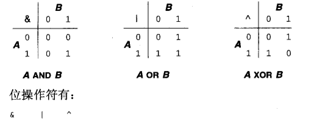

例：

| a    | 00101110 |
| ---- | -------- |
| b    | 01011011 |
| a&b  | 00001010 |
| a\|b | 01111111 |
| a^b  | 01110101 |

### 5.1.4赋值

```C
a=x=y+3
```

该语句a和x被赋的值可能不同。

假如x是一个字符型变量，那么y+3会被截去一段，以便容纳于字符类型的变量中。那么a的值将会是这个被截取后的值。

```C
char ch;
...
while((ch=getchar())!=EOF)...
```

EOF需要的位数比字符型值所能提供的位数要多，这也是getchar返回一个整型值而不是字符值的原因。然而，getchar的返回值首先存入ch中会导致它被截短，然后这个截短的值又会和EOF比较。

在使用<u>有符号字符集</u>的机器上运行时，若读取了一个值为\377的字节时，循环会终止，因为这个值截短再提升之后会和EOF相等。  在使用<u>无符号字符集</u>的机器上运行时，这会成为死循环。

### 5.1.8 条件操作符

expression1 ? expression2 : expression3

### 5.1.9 逗号操作符

expression1 , expression2 ,....,expressionN

### 5.1.10 下标引用、函数调用和结构成员

```C
//下面两种下标引用方式等价
array[下标]
*(array+(下标))
    
//结构变量访问成员
s.a
//结构指针访问成员
p->a
```

## 5.3左值和右值

一般来说，佐治就是那些能够出现在赋值符号左边的东西，右值就是那些可以出现在赋值符号右边的东西。

```C
a=b+10;
//a是左值，b+10这个整体是右值。
//a在后续使用可以出现 xxx=a的形式，因此，a还可以当作右值
//b+10不能出现b+10=xxx的形式，因此，b+10不能当作左值
```

## 5.4 表达式求值

### 5.4.1隐式类型转换

```C
char a,b,c;
...
a=b+c;
//b、c的值被提升为普通整型再做加法运算，结果将被截短再存入a中
```

### 5.4.2 算术转换

```C
int a=5000;
int b=25;
long c=a*b;
//第三行在32位整数的机器上运行无问题，但是在16位整数的机器
//上会出现乘法运算溢出。  可以改为以下形式
long c=(long)a*b
```

### 5.4.3操作符的属性

复杂表达式的求值顺序由3个因素决定：操作符的优先级、操作符的结合性、操作符是否控制执行的顺序。

## 警告的总结

1.有符号值得右移位操作是不可移植的。

2.移位操作的位数是个负值。

3.连续赋值中各个变量的长度不一。

4.误用=而不是==进行比较。

5.误用|替代||，或误用&替代&&。

6.在不同的用于表示布尔值的非零值之间进行比较。

7.表达式赋值的位置并不决定表达式计算的精度。

8.编写结果依赖于求值顺序的表达式。

## 编程提示总结

1.使用复合赋值符可以使程序更易于维护。

2.使用条件操作符替代if语句以简化表达式。

3.使用逗号操作符来消除多余的代码。

4.不要混用整型和布尔型值。


# 6、指针

## 6.1 内存和地址

变量名字和内存位置之间的关联并不是由硬件所提供的，它是由编译器为我们实现的。所有这些变量给我们一种更方便的方法记住地址--**硬件仍然通过地址访问内存位置**。


## 6.4 间接访问操作符

间接访问：通过一个指针访问它所指向的地址的过程。又称引用指针。

```C
int a=100;
int *p=a;
//p本身存储的是a的地址。通过*p可以访问到a的地址获取值100.
```

## 6.5 未初始化和非法指针

```C
int *a;
*a=12;
//a指针未初始化，我们不知道a所存储的地址到底是何处。
//因此，每次构建指针的时候一定要初始化指针所存储的地址。

//比如
int p=12;
a=p;    //这一步给了a一个地址
*a=1；
//同样的还可以  int *a=p;
```

## 6.6NULL指针

NULL指针表示不指向任何东西。要使一个指针变量未NULL，你可以给它赋一个零值。   它可以用来判断某个特定指针目前是否有指向什么东西。

在使用一个指针前，可以优先判断它是不是NULL指针。


## 6.7指针、间接访问和左值

指针变量可以作为左值，是因为它们是变量，而不是因为它们是指针。


## 6.8指针、间接访问和变量

```C
*&a=25；
//&操作符产生a的地址，*操作访问这个地址，最后将25存入该地址。
```

上句结果和a=25相同。但是上句设计更多的操作，容易降低代码的可读性。


## 6.9指针常量

```C
int a=100;
*(int *)100=25;  
//强制类型转换把100从“整型”变为“指向整型的指针”
```

这个技巧的主要用途是访问某个具体的地址。例如，操作系统需要与输入输出设备控制器通信，启动I/O操作并从前面的操作中获得结果。

## 6.10指针表达式

```C
char ch='a';
char *cp=ch;
*cp+1  //取出cp指向地址的内容'a'并+1
*(cp+1) //获取cp所指向地址的后一个地址。数组的下标操作基于此式
cp++  //将cp所指向的地址移向下一块地址
    
*cp++  //1.++操作符产生cp的一份拷贝。2.++操作符增加cp的值。
       //3.在cp的拷贝上执行间接访问操作
```

```c
strlen(char *string){
	int length=0;
    //依次访问字符串的内容，计算字符数，直到遇见NULL终止符
    while(*string++ != '\0')
        length+=1;
    return length;
}
//这个函数统计的确实是字符串的长度，但是没有统计首个字符，
//而是用'\0'代替首字符进行统计
```


## 6.13指针运算

如果p是指向x类型的指针，那么p+1就是指向下一个x类型的指针。

1.p+i得到p之后第i个x类型的指针。

2.指针-指针，结果是两个指针在内存中的距离


```C
for(vp=&values[N_VALUES];vp>&values[0]; )
	*--vp=0;

for(vp=&values[N_VALUES-1];vp>=&values[0];vp--)
    *vp=0;
//第二个循环结束之后vp会发生越界
```


## 警告的总结

1.错误地对一个未初始化的指针变量进行解引用。

2.错误地对一个NULL指针进行解引用。

3.像函数错误地传递NULL指针。

4.未检测到指针表达式的错误，从而导致不可预测的结果。

5。对一个指针进行减法运算，是它非法地指向了数组第1个元素的前面的内存位置。


## 编程提示的总结

1.一个值应该只具有一种意思。

2.如果指针并不只想任何有意义的东西，就把它设置为NULL。

# 7、函数


## 7.5递归和迭代

对于计算阶乘和斐波那契数列来说，递归并没有提供任何优越之处，而且效率非常低。

递归通过栈实现。

迭代即递推。计算阶乘和斐波那契数列用迭代效率会高非常多。

## 7.6可变参数列表

目的：让一个函数在不同时候接受不同数目的参数。

### 7.6.1 stdarg宏

头文件:stdarg.h

这个头文件声明了 一个类型va_list 和三个宏——va_start、va_arg、va_end。

函数声明一个名叫var_arg的变量，用于访问参数列表的未确定部分。该变量通过va_start初始化。它的第1个参数是va_list变量的名字，第2个参数是省略号前最后一个有名字的参数。初始化过程把var_arg变量设置为指向可变参数部分的第1个参数。

为了访问参数，需要使用va_arg，这个宏接受两个参数：va_list变量和参数列表中下一个参数的类型。    在有些函数中，你可能要通过前面获得的数据来判断下一个参数的类型。va_arg返回这个参数的值，并使var_arg指向下一个可变参数。

最后，当访问完毕最后一个可变参数之后，我们需要调用va_end。

```C
//计算指定数量的值的平均值
#include<stdarg.h>
float average(int n_values,...)
{
    va_list var_arg;
    int count;
    float sum=0;
    //准备访问可变参数
    va_start(var_arg,n_values);
    //添加取自可变参数列表的值
    for(count=0;count<n_values;count++){
        sum+=va_arg(var_arg,int );//第二个参数表示下一个参									//数的类型
    }
    //完成处理可变参数
    va_end(var_arg);
    return sum/n_values;
}
```

不过，va_arg无法正确识别作用于可变参数之上的缺省参数类型提升。char、short、float类型的值实际上将作为int或double类型的值传递给函数。


## 警告的总结

1.错误地在其他函数的作用域内编写函数原型。

2.没有为那些返回值不是整型的函数编写原型。

3.把函数原型和旧式风格的函数定义混合使用。

4.在va_arg中使用错误的参数类型，导致未定义的结果。


## 编程提示的总结

1.在函数原型中使用参数名，可以给使用该函数的用户提供更多的信息。

2.抽象数据类型可以减少程序对模块实现细节的依赖，从而提高程序的可靠性。

3.当递归定义清晰的有点可以补偿它的效率开销时，就可以使用这个工具。

# 8、数组

数组本质是指针。

## 8.1一维数组

### 8.1.2 下标引用

```C
//这两句话等价
array[subscript];
*(array+(subscript));
```

```C
int *ap=array+2;

*ap+6   //相当于array[2]+6
*(ap+6) //相当于array[2+6]
ap[-1]  //array[1]

2[array] //等价于array[2],不过不推荐写
```

指针有时比下标更有效率。

### 8.1.5 数组和指针

```C
int a[5];
int *b;
//*a合法，*b不合法。因为*b会访问内存中的未知位置
//b++合法，a++非法。因为a的值是个常量
```


### 8.1.8初始化

```C
//完整初始化
int vector[5]={10,20,30,40,50};
//不完整初始化
int vector[5]={1,2,3}; //未初始化的部分默认为0。不能出现超出数					//组范围的初始化
//自动计算长度
int vector[]={1,2,3};

//字符数组初始化
char message[]={'H','e','l','l','o',0};
char message[]="Hello";
```


```C
char message1[]="Hello";
char *message2="Hello";
//这两种声明方式的结果有区别，见下图
```


## 8.2多维数组

```C
int array[3][6];
```


### 8.2.3 下标

```C
int matrix[3][10];
```


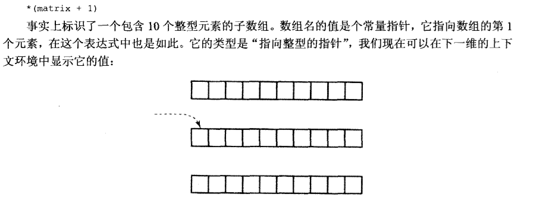

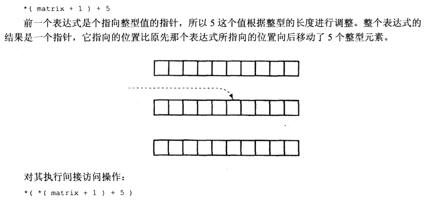


### 8.2.4指向数组的指针

```c
int vector[10], *vp=vector;  //合法
int matrix[3][10], *mp=matrix;  //非法
//matrix是一个指向整型数组的指针

//声明一个指向整型数组的指针
int (*p)[10];
//初始化
int (*p)[10]=matrix;  //p指向matrix的第一行


//两种方式创建一个简单的整型指针
int *pi=&matrix[0][0];
int *pi=matrix[0];
```


### 8.2.5作为函数参数的多维数组

```C
int matrix[3][10];
//两种等价引用
void func(int (*matrix)[10]);
void func(int mat[][10]);
```


### 8.2.6初始化

```C
int matrix[2][3]={100,101,102,110,111,112};

int matrix[3][5]={
    {00,01,02,03,04},
    {10,11,12,13,14},
    {20,21,22,23,24}
};

//初始化一个三维数组
int three_dim[2][3][5]={
    {
        {000,001,002,003,004},
        {010,011,012,013,014},
        {020,021,022,023,024}
    },
    {
        {100,101,102,103,104},
        {110,111,112,113,114},
        {120,121,122,123,124}
    }
};


//初始化一个四维数组
int four_dim[2][2][3][5]={
    {
        {
            {0000,0001,0002,0003,0004},
            {0010,0011,0012,0013,0014},
            {0020,0021,0022,0023,0024}
        },
        {
            {0100,0101,0102,0103,0104},
            {0110,0111,0112,0113,0114},
            {0120,0121,0122,0123,0124}
        }
    },
    {
        {
            {1000,1001,1002,1003,1004},
            {1010,1011,1012,1013,1014},
            {1020,1021,1022,1023,1024}
        },
        {
            {1100,1101,1102,1103,1104},
            {1110,1111,1112,1113,1114},
            {1120,1121,1122,1123,1124}
        }
    }
};


//长度自动计算
int matrix[][5]={
    {00,01,02},
    {10,11},
    {20,21,22,23}
};
```

## 8.3指针数组

```c
int *api[10];  //api数组存的是整数型指针

char const keyword[]={
    "do",
    "for",
    "if",
    "register",
    "return",
    "switch",
    "while"
};
```


## 警告的总结

1.当访问多维数组的元素时，误用逗号分隔下标。

2.在一个指向未指定长度的数组的指针上执行指针运算。

## 编程提示的总结

1.一开始就编写良好的代码显然比依赖编译器来修正劣质代码更好。

2.源代码的可读性几乎总是比程序的运行时效率更为重要。

3.只要有可能，函数的指针形参都应该声明为const。

4.在有些环境中，使用register关键字提高程序的运行时效率。

5.在多维数组的初始值列表中使用完整的多层花括号能提高可读性。

# 9、字符串、字符和字节

## 9.2字符串长度

```c
if(strlen(x)>=strlen(y)) ...
if(strlen(x)-strlen(y)>=0)...
//第二个判断将永远为真，因为strlen返回一个无符号数，无符号数
//不可能减出一个负值
```

## 9.5字符串查找基础

### 9.5.1查找一个字符

```c
char *strchr(char const *str, int ch);//查找ch第一次出现的位置
char *strrchr(char const *str, int ch);//查找ch最后出现的位置

char string[20]="Hello there, honey.";
char *ans;
ans=strchr(string,'h');
//ans所致的位置将是string+7
```


### 9.5.2查找任何几个字符

```c
char *strpbrk(char const *str, char const *group);
//该函数返回一个指向str中第1个匹配group中任何一个字符的字符位置，未找到则返回NULL指针

char string[20]="Hello there, honey.";
char *ans;
ans=strchr(string,'aeiou');
//ans将指向string+1
```


### 9.5.3查找一个字串

```c
char *strstr(char const *s1, char const *s2);
//该函数在s1中查找整个s2第一次出现的 起始位置
//不过标准库中没有 strrstr 函数，需要自己实现。

#include<string.h>
char *my_strrstr(char const *s1, char const *s2){
    //在s1中查找字符串s2最右出现的位置，并返回一个该位置的指针
    register char *last;
    register char *current;
    //把指针初始化为我们已经找到的前一次匹配位置
    last=NULL;
    //旨在第2个字符串不为空时才进行查找，若s2为空，返回NULL。
    if(*s2!='\0'){
        //查找s2在s1中第1次出现的位置
        current=strstr(s1,s2);
        //我们每次找到字符串时，让指针指向它的起始位置，然后查找该字符串的下一个匹配位置
        while(current!=NULL){
            last=current;
            current=strstr(last+1,s2);
        }
    }
    //返回指向我们找到的最后一次匹配的起始位置的指针
    return last;
}
```


## 9.6高级字符串查找

### 9.6.1查找一个字符串前缀

```c
size_t strspn(char const *str, char const *group);
//返回str起始部分匹配group中仍以字符的字符数
int len1,len2;
char buffer[]="25,142,330,Smith,J,239-4123";

len1=strspn(buffer,"0123456789");  //len1=2
len2-strspn(buffer,",0123456789");  //len2=11


size_t strcspn(char const *str, char const *group);
//返回str字符串起始部分中不与group中任何字符匹配的字符数。
```


### 9.6.2查找标记

```c 
char *strtok(char *str, char const *sep);
//sep定义了用作分隔符的 字符集合 。strtok找到str的下一个标记，并将其用NULL结尾，然后返回一个指向这个标记的指针。
//str会被修改
//如果第1个参数是NULL，函数就在同一个字符串中从这个被保存的位置开始像前面一样查找下一个标记


#include<stdio.h>
#include<string.h>
void print_tolens(char *line){
//从一个字符数组中提取空白字符分割的标记并把它们打印出来(每行一个)。
    static char whitespace[]=" \t\f\r\v\n";
    char *token;
    
    for(token=strtok(line,whitespace);
       token!=NULL;
       token=strtok(NULL,whitespace)) //第一个参数为NULL，因此直接从token的位置开始寻找下一处分隔标记
          printf("Next token is %s\n",token);
}
```

## 9.7错误信息

```c
char *strerror(int error_number);
//该函数把其中一个错误代码作为参数并返回一个指向用于描述错误的字符串指针
```


## 9.8字符操作

头文件：ctype.h

### 9.8.1字符分类

| 函数     | 如果它的参数复合下列条件就返回真                             |
| -------- | ------------------------------------------------------------ |
| iscntrl  | 任何控制字符                                                 |
| isspace  | 空白字符：空格' '、换页'\f'、换行'\n'、回车'\r'、制表符'\t \v' |
| isdigit  | 十进制数字0~9                                                |
| isxdigit | 十六进制数字，包括所有十进制数字。a(A)~f(F)                  |
| islower  | 小写字母a~z                                                  |
| isupper  | 大写字母A~Z                                                  |
| isalpha  | 大小写字母                                                   |
| isalnum  | 字母或数字                                                   |
| ispunct  | 标点符号，任何不属于数字或字母的图形字符                     |
| isgraph  | 任何图形字符                                                 |
| isprint  | 任何可打印字符，包括图形字符和空白字符                       |

### 9.8.2字符转换

```c
int tolower(int ch); //字母转小写
int toupper(int ch);
```


## 9.9内存操作

目的：避免非字符串数据内部包含零值的情况，这类情况无法使用字符串函数来处理，因为当它们遇到第一个NULL字节时将停止工作。

注：任何类型的指针都可以转换为void* 指针

```c 
void *memcpy(void *dst, void const *src, size_t length);
//从src的起始位置赋值length个字节到dst的内存起始位置
void *memmove(void *dst, void const *src, size_t length);
void *memcmp(void const *a, void const *b, size_t length);
void *memchr(void const *a, int ch, size_t length);
void *memset(void *a, int ch, size_t length);

//这些函数整体功能和str系列函数差不多，但它们可以处理包括NULL字节在内的任意字节
```


## 警告的总结

1.应该使用有符号数的表达式中使用strlen函数。

2.在表达式中混用有符号数和无符号数。

3.使用strcpy函数把一个长字符串复制到一个较短的数组中，导致溢出。

4.使用strcat函数把一个字符串添加到一个数组中，导致数组溢出。

5.使用strcmp函数返回值当作布尔值进行测试。

6.把strcmp函数的返回值与1和-1比较。

7.使用并非以NULL字节结尾的字符序列。

8.使用strncpy函数产生不以NULL字节结尾的字符串。

9.把strncpy函数和strxxx族函数混用。

10.忘了strtok函数将会修改它所处理的字符串。

11.strtok函数是不可再入的。


## 编程提示总结

1.不要试图自己编写技能相同的函数来取代库函数。

2.使用字符分类和转换函数可以提高函数的移植性。


# 10、结构体和联合

与数组不同，每个结构体成员都有自己的名字，它们都是通过名字访问的。

## 10.1结构体基础

### 10.1.1结构体声明

```  c
struct {
    int a;
    char b;
    float c;
}x;

struct {
    int a;
    char b;
    float c;
}y[20],*z;   //这种声明和上一个声明再编译器中是两种不同的类型，即			使它们的成员列表完全相同。
//因此，z=&x;  非法
```

```c
//利用标签创建变量
struct SIMPLE{
    int a;
    char b;
    float c;
};
struct SIMPLE x;
struct SIMPLE y[20],*z;

//利用typedef
typedef struct{
    int a;
    char b;
    float c;
}Simple;

Simple x;
Simple y[20],*z;
```

### 10.1.3成员访问

```c
typedef struct{
    int a;
    char b;
    float c;
}Simple;

//一般访问
Simple x;
x.a;
//指针访问
Simple *p=&x;
(*p).a;     p->a;
```


### 10.1.5结构体自引用

```c
struct SELF_REF{
	int a;
	int c;
	struct SELF_REF *b;   
};//自引用必须是指针而不是一般结构体，因为编译器再结构体的长度确定之前就已经知道指针的长度。
```

### 10.1.6不完整声明

```c
//构建两个互相引用的结构体
struct B;  //不完整声明
struct A{
	struct B *partner;
};
struct B{
	struct A *partner;
};
```


### 10.1.7结构体初始化

```c
typedef struct{
    int a;
    char b;
    float c;
}Simple;

struct INIT_EX{
    int a;
    short b[10];
    Simple c;
}x={
    10,
    {1,2,3,4,5},
    {25,'x',1.9};
}
```


## 10.3结构的存储分配

```c
struct ALIGN{
    char a;
    int b;
    char c;
};  //成员在编译时会按声明顺序进行存储
```


显然，a后面会先浪费3个空间再存b，为了节省空间，可以如下声明

```c
struct ALIGN{
    int b
    char a；
    char c;
}; 

//sizeof操作可以得出一个结构体的整体长度，包括上述浪费的空间。

//如果必须确定结构某个成员的实际位置，可以使用offsetof宏(stddef.h)
offsetof(type , memeber);
//如 offsetof(struct ALIGN, b); 会返回b的首地址
```

## 10.4作为函数参数

若不使用指针传递，一个大体量的结构体的值传递将会花费较大资源拷贝一个备份传入堆栈，函数调用完之后又要删除，这样效率很低。

推荐使用指针传递，为了防止结构体被修改，可以将指针引用声明为const。

另外，还可以把参数声明为寄存器变量，从而进一步提高指针传递方案的效率。

```c
void f(register SIMPLE const *trans);
```


## 10.5位段

```c
//声明
struct CHAR{
    unsigned ch		:7;
    unsigned font	:6;
    unsigned size	:19;
};
struct CHAR ch1;
//该结构体可以处理128(2^7)个不同的字符值、64(2^6)种不同的字体、0~524287个单位的长度。

```


另一个使用位段的理由就是它们可以很方便地访问一个整型值得部分内容。

例：操作系统中，用于操作软盘的代码必须与磁盘控制器通信。这些设备控制器常常包含了几个寄存器，每个寄存器又包含了许多包装在一个整型值内的不同的值。位段就是一种方便访问这些单一值得方法。假定磁盘控制器其中一个寄存器是如下定义的：


前5个位段每个都占1位，其余几个位段更长一些。在一个从右向左分配位段的机器上，下面这个声明允许程序方便对这个寄存器的不同位段进行访问。

```C
struct DISK_REGISTER_FORMAT{
    unsigned command		:5;
    unsigned sector			:5;
    unsigned track			:9;
    unsigned error_code		:8;
    unsigned head_loaded	:1;
    unsigned write_protect	:1;
    unsigned disk_spinning	:1;
    unsigned error_occurred	:1;
    unsigned ready			:1;
};


//假如磁盘寄存器是在内存地址0xc0200142进行访问的，我们可以声明下面的指针常量
#define DISK_REGISTER \
	((struct DISK_REGISTER_FORMAT *)0xc0200142)

//告诉控制器从哪个扇区哪个磁道开始读取
DISK_REGISTER->sector=new_sector;
DISK_REGISTER->track=new_track;
DISK_REGISTER->command=new_READ;

//等待，知道操作完成(ready变量变成真)
while(!DISK_REGISTER->ready)  ;

//检查错误
if(DISK_REGISTER->error_occurred){
    switch(DISK_REGISTER->error_code){
            ...
    }
}


//赋值
#define DISK_REGISTER (unsigned int*)0xc0200142  //与前一个define作用相同
*DICK_REGISTER &=0XFFFFFC1F; //使用与操作把sector字段清零，但不影响其他字段
*DISK_REGISTER |= (new_sector & 0x1f) <<5; //接受new_sector的值，&确保这个值不会超过这个位段的宽度。接着，把它左移到合适的位置，然后再用 | 把这个字段设置为重要的值
```


## 10.6联合

目的：在<u>不同的时刻</u>把不同的东西存储在同一个位置。

```c
union{
	float f;
	int i;
}fi;
//分配给联合的内存数量取决于它的最长成员的长度
```

事实上，假如union的存储长度很长，但是某一时刻它实际存入的内容很短，这就会造成资源浪费。为了节省空间，可以让union存储不同类型的指针，所有指针的存储长度是相同的。

### 10.6.2初始化

```c
union{
	int a;
	float b;
	char c[4];
}x={5}; //初始值必须是联合第1个成员的类型
```

## 警告的总结

1.具有相同成员列表的结构声明产生不同类型的变量。

2.使用typedef位一个自引用的结构体定义名字时应该小心。

3.向函数传递结构参数是低效的。

## 编程提示总结

1.把结构标签声明和结构的typedef声明放在头文件中，当源文件需要这些声明时可以通过#include进行引用。

2.结构成员的最佳排列方式并不一定就是考虑边界对齐而浪费内存空间最少的那种排列形式(要在可读性和省空间之间有所权衡)。

3.把位段成员显式地声明为signed int 或unsigned int 类型。

4.位段是不可移植的。

5.位段使源代码中位的操作表达得更为清楚。

# 11、动态内存分配

基本函数：malloc(分配内存)、free(释放内存)

头文件：stdlib.h

```c
void *malloc(size_t size); //分配一个指定大小的连续内存，若操作系统无法向malloc提供更多内存，malloc会返回NULL指针
coid free(void *pointer); //参数要么是NULL，要么是先前从malloc、calloc、realloc返回的值
```

## 11.3calloc和realloc

```c
void *calloc(size_t num_elements, size_t element_size);//返回的指针会顺便初始化
void *realloc(void *ptr, size_t new_size);//修改一个原先已经分配的内存块的大小
```

## 11.4使用例

```c
int *pi;
pi=malloc(100);
if(pi==NULL){ //错误检查
    printf("Out of memory.\n");
    exit(0);
}

//分配一个足够存储25个整数的内存
pi=malloc(25*sizeof(int)); //可移植
//对pi既可以进行*pi++操作，还可以进行pi[i]操作
```

## 11.5常见的动态内存错误

错误分类：

1.对NULL指针进行解引用。

2.对分配的内存进行操作时越界。

3.释放并非动态分配的内存。

4.试图释放一块动态分配的内存的一部分。

5.一块动态内存被释放之后被继续使用。

```c
alloc.h
//定义一个不易发生错误的内存分配器
#include<stdlib.h>
#define malloc     //不要直接调用malloc
#define MALLOC(num , type)  (type*)alloc((num)*sizeof(type))
extern void *alloc(size_t size);
//alloc可以调用malloc并进行检查，确保返回的指针不是NULL
```

```c
//接口
#include<stdio.h>
#include "alloc.h"
#undef malloc
void *alloc(size_t size){
    void *new_mem;
    //请求所需的内存，并检查确实分配成功
    new_mem=malloc(size);
    if(new_mem==NULL){
        printf("Out of memory.\n");
        exit(1);
    }
    return new_mem;
}
```

```c 
//实现
#include "alloc.h"
void function(){
    int *new_memory;
    //获得一串整型数的空间
    new_memory=MALLOC(25,int);
}
```

#### 不要访问被free释放的内存

```c
int *p=malloc(100);
int *q=p;
free(p);
//p释放后，q也不能再使用，除非改变了q的内容
```

#### 内存泄漏

分配内存但在使用完毕后不释放将引起内存泄露(memory leak)。这会一点点榨干可用内存，除非重启系统。

## 警告的总结

1.不检查从malloc函数返回的指针是否为NULL。

2.访问动态分配内存之外的区域。

3.向free函数传递一个并非由malloc番薯返回的指针。

4.在动态内存被释放之后再访问它。

## 编程提示总结

1.动态内存分配有助于消除程序内部存在的限制。

2.使用sizeof计算出具类型的长度，提高程序的可移植性。


# 12、使用结构和指针


## 12.3双链表

注：读代码时可以在草稿纸上模拟链表操作

```c
//双链表结点定义   doubly_linked_list_node.h
typedef struct NODE{ 
    struct NODE *fwd;
    struct NODE *bwd;
    int value;
}Node;
```

### 12.3.1双链表插入操作的优化

```c
//一般的双链表插入函数
#include<stdlib.h>
#include<stdio.h>
#include "doubly_linked_list_node.h"
int dll_insert(Node *rootp, int value)
{
    Node *this;
    Node *next;
    Node *newnode;
    /*
    	查看value是否已经存在于链表中，如果是就返回。
    	否则，为心的值创建一个新节点(newnode指向它)
    	"this"指向新节点之前的那个结点
    	"next"指向新节点之后的那个结点
    */
    for(this=rootp ; (next=this->fwd)!=NULL;this=next){
        if(next->value==value) return 0;
        if(next->value>value) break;
    }
    
    newnode=(Node *)malloc(sizeof(Node));
    if(newnode==NULL) return -1;
    newnode->value=value;
    
    //把新值添加到链表中
    if(next!=NULL){
        //情况1、2：并非位于链表尾部
        
        if(this!=rootp){//情况1：并非位于链表起始位置
            newnode->fwd=next;
            this->fwd=newnode;
            newnode->bwd=this;
            next->bwd=newnode;
        }
        else{			//情况2：位于链表起始位置
            newnode->fwd=next;
            rootp->fwd=newnode;
            newnode->bwd=NULL;
            next->bwd=newnode;
        }
    }
    else{
        //情况3、4：位于链表尾部
        
        if(this!=rootp){//情况3：并非位于链表起始位置
            newnode->fwd=NULL;
            this->fwd=newnode;
            newnode->bwd=this;
            rootp->bwd=newnode;
        }
        else{			//情况4：位于链表起始位置
            newnode->fwd=NULL;
            rootp->fwd=newnode;
            newnode->bwd=NULL;
            rootp->bwd=newnode;
        }
    }
    return 1;
}
```

仔细分析可以发现，不同情况中存在相同的操作，可以进行提炼化简代码

```c
//第一次逻辑提炼
if(next!=NULL){
        //情况1、2：并非位于链表尾部
        
        newnode->fwd=next;
        if(this!=rootp){//情况1：并非位于链表起始位置
            this->fwd=newnode;
            newnode->bwd=this;
        }
        else{			//情况2：位于链表起始位置
            rootp->fwd=newnode;
            newnode->bwd=NULL;
        }
    	next->bwd=newnode;
    }
    else{
        //情况3、4：位于链表尾部
        
        newnode->fwd=NULL;
        if(this!=rootp){//情况3：并非位于链表起始位置
            this->fwd=newnode;
            newnode->bwd=this;
        }
        else{			//情况4：位于链表起始位置
            rootp->fwd=newnode;
            newnode->bwd=NULL;
        }
        rootp->bwd=newnode;
    }
```

这个过程其实还可以简化。先看一个例子

```c
if(pointer !=NULL) field=pointer;
else field=NULL;

//上面的判断本质上等价于下句
field=pointer

//因此，之前代码的if(next != NULL)判断可以用这种方法化简
newnode->fwd=next;
if(this!=rootp){
    this->fwd=newnode;
    newnode->bwd=this;
}
else{
    rootp->fwd=newnode;
    newnode->bwd=NULL;
}

if(next!=NULL) next->bwd=newnode;
else rootp->bwd=newnode;
```

```c
//最终版本

#include<stdlib.h>
#include<stdio.h>
#include "doubly_linked_list_node.h"
int dll_insert(Node *rootp, int value)
{
    register Node *this;
    register Node *next;
    register Node *newnode;
    /*
    	查看value是否已经存在于链表中，如果是就返回。
    	否则，为心的值创建一个新节点(newnode指向它)
    	"this"指向新节点之前的那个结点
    	"next"指向新节点之后的那个结点
    */
    for(this=rootp ; (next=this->fwd)!=NULL;this=next){
        if(next->value==value) return 0;
        if(next->value>value) break;
    }
    
    newnode=(Node *)malloc(sizeof(Node));
    if(newnode==NULL) return -1;
    newnode->value=value;
    
    //把新值添加到链表中
    newnode->fwd=next;
    this->fwd=newnode;
    
    if(this!=rootp) newnode->bwd=this;
    else newnode->bwd=NULL;
    
    if(next!=NULL) next->bwd=newnode;
    else rootp->bwd=newnode;
    
    return 1;
}
```


## 警告的总结

1.落到链表尾部的后面。

2.使用指针时应格外小心，因为C并没有对它们的使用提供安全网。

3.从if语句中提炼语句可能会改变测试结果。


## 编程提示的总结

1.消除特殊情况使代码更易于维护。

2.通过提炼语句消除if语句中的重复语句。

3.不要仅仅根据代码的大小评估它的质量。

# 13、高级指针话题

## 13.2高级声明

```c
int *f();   //声明一个函数，它返回一个指向整型的指针
int (*f)(); //声明一个函数的指针，它指向的函数返回一个整型值

int *(*f)(); //和上一句相同，但必须对其进行间接访问操作才能得到整型值

int *f[]; //f是一个数组，它的元素类型是指向整型的指针。
int f()[];  //f是一个函数，它的返回值是一个整型数组。不过这个声明是非法的，因为这里的函数只能返回标量值。
int f[]();   //f是个数组，它的元素类型是返回值为整型的函数。这个声明也是非法的，因为数组元素必须有相同的长度。

int (*f[])(); //这个声明是合法的。先求*f[]，f是一个元素为某种类型的指针的数组。然后看()号，说明f的数组元素是函数指针，这些指针所指向的函数的返回值是一个整型值

int *(*f[])(); //与上一句同理，只是多了个间接访问符


/*==============================================================*/


int (*f)(int ,float);
int *(*g[])(int ,float);
//前者把f声明为一个函数指针，这个函数接受int和float两个类型的参数。
//后者则是一个存函数指针的数组
```


## 13.3函数指针

```c
int f(int);
int (*pf)(int)=&f;

//调用
int ans;
ans=f(25);
ans=(*pf)(25);
ans=pf(25);
```

### 13.3.1回调函数

向函数传递一个指向值的指针而不是值本身。函数有一个void* 形参，用于接收这个参数。  这样字符串和数组对象也可以被调用。字符串和数组无法作为参数传递给函数，但是指向它们的指针可以。

```c
/*
	在一个单链表中查找一个指定值的函数，它的参数是一个指向链表第1个结点的指针，一个指向我们需要查找的值的指针和一个函数指针，它所指向的函数用于比较存储与链表中的类型的值。
*/
#include<stdio.h>
#include "node.h"

Node* search_list(Node *node, void const *value.
          int(*compare)(void const *, void const *))
{
    while(node!=NULL){
        if(compare(&node->value,value)==0) break;
        node=node->link;
    }
    return node;
}//类型无关的链表查找
```

### 13.1.2转换表

```c
//简易计算器
switch(oper){
    case ADD:
        result=add(op1,op2);
        break;
    case SUB:
    	result=sub(op1,op2);
    	break;
    case MUL:
        result=mul(op1,op2);
        break;
    case DIV:
        result=div(op1,op2);
        break;
}

//函数声明
double add(double,double);
double sub(double,double);
double mul(double,double);
double div(double,double);
...
double (*oper_func[])(double,double)={
    add,sub,mul,div...
};

//这一句可以取代一开始的switch语句
result=oper_func[oper](op1,op2);
//oper从数组中选择正确的函数指针，而函数调用操作符将执行这个函数
```


## 13.4命令行参数

C的main函数有两个形参。第1个通常称为argc，它表示命令行参数的数目。第2个通常称为argv，它指向一组参数值的首元素。这些元素的每个都是指向一个参数文本的指针。

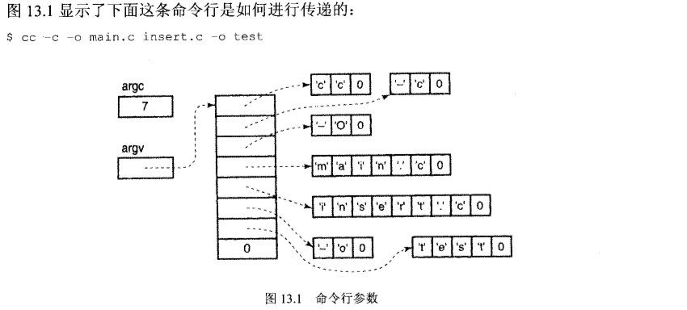


```c
//处理命令行参数
#include<stdio.h>
#define TRUE 1

//执行实际任务的函数的原型
void process_standard_input(void);
void process_file(char *file_name);

//选项标志，缺省初始化为FALSE
int option_a, option_b;

void main(int argc, char **argv){
    //处理选项参数:跳到下一个参数，并检查它是否以一个横杠开头
    while(*++argv!=NULL && **argv=='-'){
        //检查横杠后面的字母
        switch(*++*argv){
            case 'a':
                option_a=TRUE;
                break;
            case 'b':
                option_b=TRUE;
                break;
        }
    }
    
    //处理文件名参数
    if(*argv==NULL) process_standard_input();
    else {
        do{
            process_file(*argv);
        }while(*++argv!=NULL);
    }
}
```

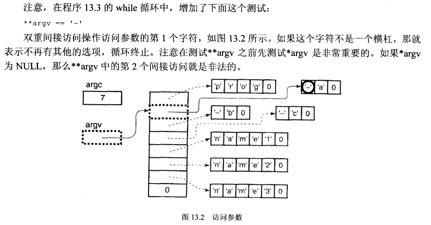

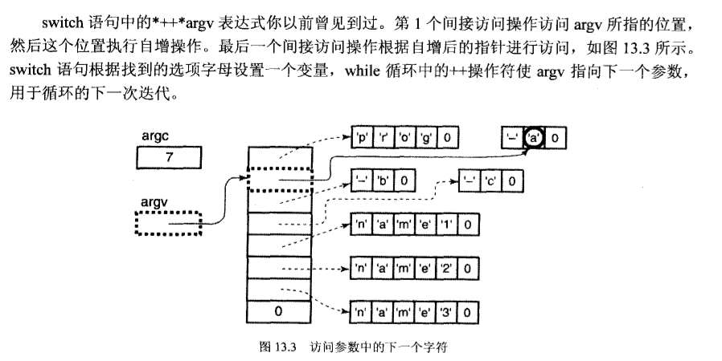

## 13.5字符串常量

```c
"xyz"     //这就是一个字符串常量，可以通过"xyz"[2]得到第3个字符
"xyz"+1;
*"xyz";   //返回'y'

putchar("0123456789ABCDEF"[value%16]);
//使用余数作为下标打印指定位置的字符串
```

```c
//打印星号
#include<stdio.h>
void f(int n){
    n+=5;
    n/=10;
    printf("%s\n","**********"+10-n);
}
```


## 警告的总结

1.对一个未初始化的指针执行间接访问操作。

2.在转移表中使用越界下标。


## 编程提示总结

1.如果并非必要，避免使用多层间接访问。

2.cdecl程序可以帮助你分析复杂的声明。

3.把void* 强制转换为其他类型的指针式必须小心。

4.使用转移表时，应始终验证下标的有效性。

5.破坏性的命令行参数处理方式会使你以后无法再次进行处理。

6.不寻常的diamagnetic始终应该加上一条注释，描述它的目的和原理。


# 14、预处理器

## 14.1预定义符号


## #define

```c
#define name stuff
//每当有符号name出现在这条指令后面使，预处理器就会把它替换成stuff
#define reg register
#define do_forever for(;;)
#define CASE break;case

#define DEBUG_PRINT printf("File %s line %d:"\
						"x=%d,y=%d,z=%d",\
						__FILE__,__LINE__,\
						x,y,z)
//内容过长可以用\代表分行
#define PROCESS_LOOP  \
	for(i=0;i<10;i+=1){  \
		sum+=i;			\
		if(i>0) prod*=i;  \
	}
```

### 14.2.1宏

把参数替换到文本中，这种实现叫做宏（macro）。

```c
#define SQUARE(x) (x)*(x)    //宏不用分号结尾
SQUARE(5)  //会被替换成5*5
    
//第一句若不写为(x)*(x)，则会出现问题，见下例
SQUARE(a+1)   //会替换成   a+1*a+1而不是(a+1)*(a+1)
```

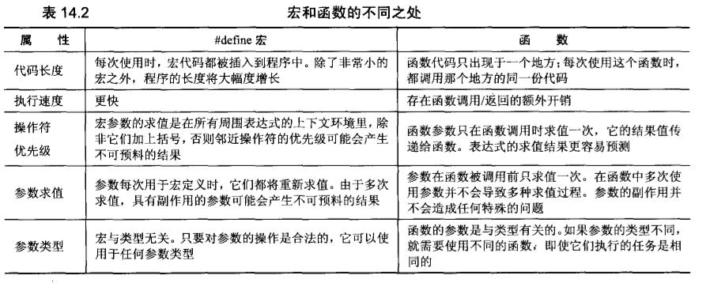


## 14.2.6#undef

```c
#undef name
//如果一个现存的名字需要重新定义，那么它的旧定义首先必须用#undef移除
```


## 14.3条件编译

```c
#if constant-expression
	statements
#elif constant-expression
        other statements
#else
        other statements
#endif
//如果常量表达式的值非零，那么statements部分会被正常编译，否则预处理器会删除它们
```

## 14.3.1是否被定义

```c
#if defined(symbol)
#ifdef symbol

#if !defined(symbol)
#ifndef symbol

//例
#if x>0 || defined(A) && defined(B)
```

## 14.4文件包含

一个头文件如果被包含到10个源文件中，它实际上被编译了10次。

```c
#include<filename>   //标准库文件
#include"filename"   //自定义头文件
```

#### 避免多重包含

```C
#ifdef _HEADERNAME_H
#define _HEADERNAME_H 1  //如果头文件再次被包含，通过条件编译，它的所有内容被忽略
	...//included filenames
#endif
```

## 14.5其他指令

```c
//#error
#error text of error message    //生成错误信息

//例
#if defined(OPTION_A)
	stuff needed for option A
#elif defined(OPTION_B)
	stuff needed for option B
#elif defined(OPTION_C)
	stuff needed for option C
#else
     #error No option selected!
#endif
        
        
//#line
#line number "string"
//通知预处理器number是下一行输入的行号。如果给出了可选部分"string"，预处理器就把它作为当前文件的名字。
        
        
//#progma   语法因编译器而异
```

## 警告的总结

1.不要在一个宏定义的末尾加上分号，使其称为一条完整的语句。

2.在宏定义中使用参数，但忘了在它们周围加上括号。

3.忘了在整个宏定义的两边加上括号。


## 编程提示的总结

1.避免用#define指令定义可以用函数实现的很长序列的代码。

2.在那些对表达式求值的宏中，每个宏参数出现的地方都应该加上括号，并且在整个宏定义的两边也加上括号。

3.避免使用#define宏创建一种新语言。

4.采用命名约定，使程序员很容易看出某个标识符是否为#define宏。

5.只要合适就应该使用文件包含，不必担心它的额外开销。

6.头文件只应该包含一组函数和(或)数据的声明。

7.把不同集合的声明分离到不同的头文件中可以改善信息隐藏。

8.嵌套的#include文件使我们很难判断源文件之间的依赖关系。


# 15、输入/输出函数

## 15.1错误报告

```c
//stdio.h
void perror(char const *message);
//如果message不是NULL并且指向一个非空的字符串，perror函数就打印出这个字符串，后面跟一个分号和一个空格，然后打印出一条用于解释errno当前错误代码的信息
//只有当一个库函数失败时，errno才会被设置。因此，只有当被调用的函数提示有错误发生时检查errno的值才有意义
```

## 15.2终止执行

```c
//stdlib.h
void exit(int status);   //直接结束程序，status参数返回给操作系统，用于提示程序是否正常完成
```

## 15.4 ANSI I/O概念

### 15.4.1流

ANSI C 中。所有的I/O操作只是简单地从程序移进或移出字节的事情。这种字节流被称为流。

绝大多数流时完全缓冲的，这说明"读取"和"写入"实际上是从一块被称为缓冲区的内存区域来回复制数据。

用于输出流的缓冲区只有当它写满是才会被刷新(flush, 物理写入)到设备或文件中。 一次性把写满的缓冲区写入和逐片把程序产生的输出分别写入相比效率更高。类似，输入缓冲区当它为空时通过从设备或文件读取下一块较大的输入，重新填充缓冲区。


### 15.4.2文件

stdio.h中定义了FILE结构，用于访问一个流。

对于每个ANSI C程序，运行时必须提供至少三个流：标准输入(standard input)、标准输出(standard output)和标准错误(standard error)。这些流的名字分别为stdin、stdout、stderr，它们都是一个指向FILE结构的指针。

### 15.4.3标准I/O常量

FOPRN_MAX定义了至少能同时打开多少文件。

FILENAME_MAX用于提示一个字符数组应该多大以便容纳编译器所支持的最长合法文件名


## 15.5流I/O总览


## 15.6打开流

```c
FILE *fopen(char const *name, char const *mode);
//第一个参数是相关的文件名，第二个参数是提示流是用于只读、只写还是读写
//每次调用这个函数时最好都检查一下它的返回值
FILE *input;
input=fopen("data3","r");
if(input==NULL){
    perror("data3");
    exit(EXIT_FAILURE);
}
```

|        | 读取 | 写入 | 添加 |
| ------ | ---- | ---- | ---- |
| 文本   | "r"  | "w"  | "a"  |
| 二进制 | "rb" | "wb" | "ab" |

```C
FILE *freopen(char const *filename, char const *mode, FILE *stream);
//这个函数首先试图关闭这个流，然后用指定的文件和模式重新打开这个流。如果打开失败，函数返回一个NULL值。反之，返回它的第3个参数值。
```


## 15.7关闭流

```c
int fclose(FILE *f);
//对于输出流，该函数在文件关闭之前刷新缓冲区。成功则返回零值，反之返回EOF
```

## 15.8字符I/O


```c
//获取字符
int fgetc(FILE *stream);
int getc(FILE *stream);
int getchar(void);

//输出字符
int fputc(int character, FILE *stream);
int putc(int character, FILE *stream);
int putchar(int cahracter);

//撤销字符
int ungetc(int character, FILE *stream);
```


```c
//把一串从标准输入读取的数字转换为整数
#include<stdio.h>
#include<ctype.h>
int read_int(){
    int value=0;
    int ch;
    
    //转换从标准输入读取的数字，当我们得到一个非数字字符时就停止
    while((ch=getchar())!=EOF && isdigit(ch)){
        value*=10;
        value+=ch-'0';
    }
    //把非数字字符退回到流中，这样它就不会丢失
    ugetc(ch,stdin);
    return value;
}

//如果用fseek、fsetpos或rewind函数改变了流的位置，所有退回的字符都将被丢弃
```

## 15.9未格式化的行I/O

未格式化的I/O简单读取或写入字符。而格式化的I/O则执行数字和其他变量的内部和外部表示形式之间的转换。

```c
//把标准输入读取的文本行逐行复制到标准输出
#include<stdio.h>
#define MAX_LINE_LENGTH 1024

void copylines(FILE *input. FILE *output){
    char buffer[MAX_LINE_LENGTH];
    
    while(fgets(buffer,MAX_LINE_LENGTH,input)!=NULL)
        fputs(buffer,output);
}
```


## 15.10格式化的行I/O

## 15.10.1 scanf族

```c
int fscanf(FILE *stream, char const *format,...);
int scanf(char const *format,...);
int sscanf(char const *string, char const *format,...);
//这些函数都从输入源读取字符并根据format字符串给出的格式化代码对它们进行转换


//使用例
nfields=fscanf(input,"%4d %4d %4d",&a,&b,&c);
//这个宽度参数把整数值的宽度限制为4个数字或更少。
//输入 1  2 。  此时a=1,b=2,c不变,nfields=2.
//输入 12345 67890。 此时a=1234,b=5,c=6789,nfields=3
```

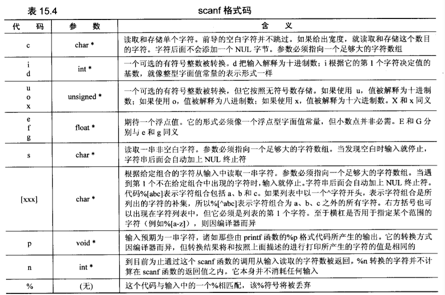


```c
//用sscanf处理行定向(line-oriented)的输入
#include<stdio.h>
#define BUFFER_SIZE 100

void function(FILE *input){
    int a,b,c,d,e;
    char buffer[BUFFER_SIZE];
    
    while(fgets(buffer,BUFFER_SIZE,input)!=NULL){
        if(sscanf(buffer,"%d %d %d %d %d",
                 &a,&b,&c,&d,&e)!=4){
            		fprintf(stderr,"Bad input skipped: %s",
                            buffer);
            		continue;
        }
        //处理输入
    }
}
```

```c
//使用sscanf处理可变格式的输入
#include<stdio.h>
#include<stdlib.h>

#define DEFAULT_A 1
#define DEFAULT_B 2

void function(char *buffer){
    int a,b,c;
    //查看3个值是否都已经给出
    if(sscanf(buffer,"%d %d %d",&a,&b,&c)!=3){
        //否，对a使用缺省值，看看其他两个值是否已经给出
        a=DEFAULT_A;
        if(sscanf(buffer,"%d %d",&b,&c)!=2){
            //为b使用缺省值，寻找剩余的值
            b=DEFAULT_B;
            if(sscanf(buffer,"$d",&c)!=1){
                fprintf(stderr,"Bad input: %s",buffer);
                exit(EXIT_FAILURE);
            }
        }
    }
    //处理a,b,c
}
```


### 15.10.3 printf族

```c
int fprintf(FILE *stream, char const *format, ...);
int printf(char const *format,...);
int sprintf(char *buffer, char const *format,...);
```

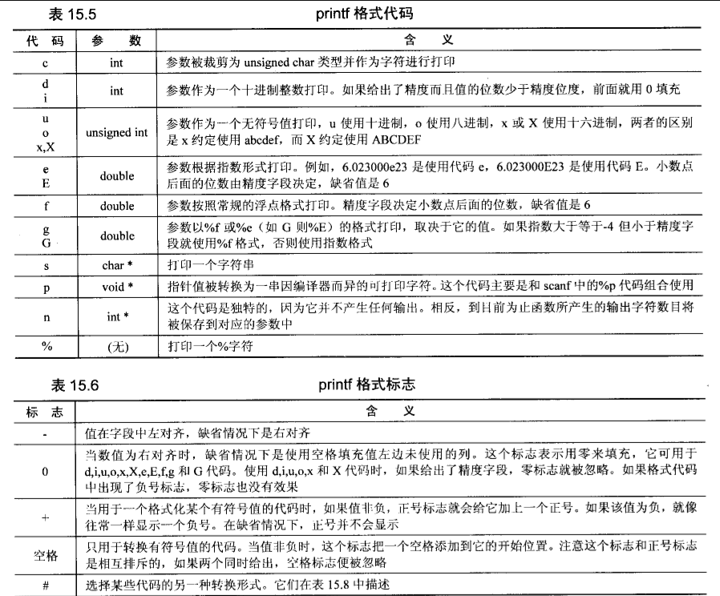

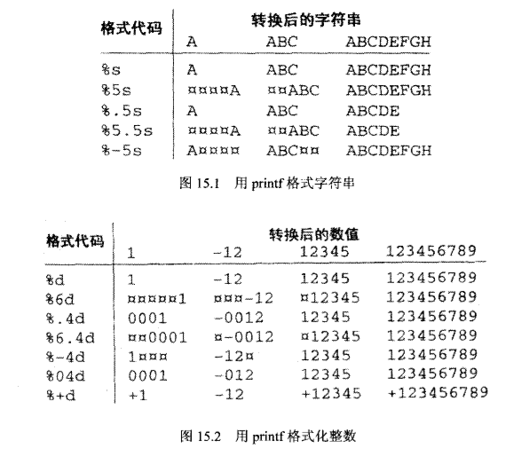

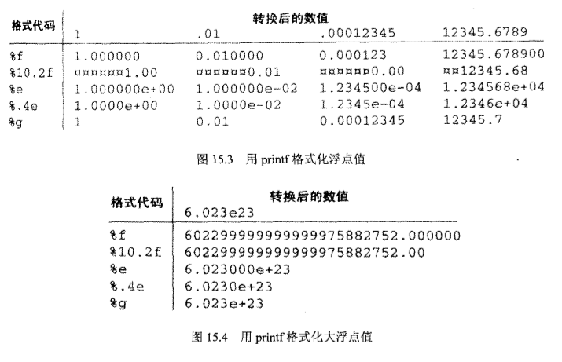


## 15.11二进制I/O

```C
size_t fread(void *buffer, size_t size, size_t count, FILE *stream);
size_t fwrite(void *buffer, size_t size, size_t count, FILE *stream);
//buffer时一个指向用于保存数据的内存位置的指针，size时缓冲区中每个元素的字节数，count时读取或写入的元素数
```

## 15.12刷新和定位函数

```c
int fflush(FILE *stream);
//该函数迫使输出流的缓冲区内的数据进行物理写入，不管它是否已满

//随机访问I/O
long ftell(FILE *stream);//返回流当前的位置
int fseek(FILE *stream, long offset, int from);//改变读写位置
```


| 如果from是... | 你将定位到                                                   |
| ------------- | ------------------------------------------------------------ |
| SEEK_SET      | 从流的起始位置起offset个字节，offset必须是一个非负值。       |
| SEEK_CUR      | 从流的当前位置起offset个字节，offset可正可负。               |
| SEEK_END      | 从流的尾部位置起offset个字节，offset可正可负。如果为正，它将定位到文件尾的后面 |

```c
void rewind(FILE *stream);
//rewind将读/写指针设置回指定流的起始位置。同时清除流的错误提示信息
int fgetpos(FILE *stream, fpos_t *position);
int fsetpos(FILE *stream, fpos_t const *position);
//后两个函数是rewind的替代方案
```

## 15.13改变缓冲方式

```c
void setbuf(FILE* stream, char *buf);
//setbuf设置了另一个数组，用于对流进行缓冲
int setvbuf(FILE *stream,char *buf, int mode,size_t size);
//mode参数用于指定缓冲的类型。_IOFBF指定一个完全缓冲的流，_IONBF指定一个不缓存的流，_IOLBF指定一个行缓冲流。
```

### 15.14流错误函数

```c
//判断流的状态
int feof(FILE *stream);
//如果流当前处于文件尾，feof返回真。这个状态可以通过对流执行feseek、rewind或fsetpos函数来清除

int ferror(FILE *stream);
//ferror报告流的错误状态，如果出现任何读写错误就返回真
void clearerr(FILE *stream);
//clearerr对指定流的错误标志进行重置
```

## 15.15临时文件

```c
FILE *tmpfile(void);
//创建一个文件，当文件被关闭或程序终止时这个文件会自动删除
char *tmpnam(char *name);
//给临时文件起名
```

## 15.16 文件操纵函数

```c
int remove(char const *filename);
//删除一个指定文件
int rename(char const *oldname, char const *newname);
//重命名指定文件
```


## 警告的总结

1.忘了在一条调试用的printf语句后跟一个fflush调用。

2.不检查fopen函数的返回值。

3.改变文件的位置将丢弃任何被退回到流的字符。

4.在使用fgets时指定太小的缓冲区。

5.使用gets的输入溢出缓冲区且违背检测到。

6.使用任何scanf/printf系列函数时，格式代码和参数指针类型不匹配。

7.在任何scanf系列函数的每个非数组、非指针参数前忘了加上&符号。

8.注意在使用scanf系列函数转换double、long double、short和long整型时，在格式化代码中加上合适的限定符。

9.sprintf函数的输出溢出了，且缓冲区未检测到。

10.混淆printf和scanf格式代码。

11.在有些长整数长于普通整数的机器上打印长整数值时，忘了在格式代码中指定l修改符。

12.使用自动数组作为流的缓冲区时多加小心。


## 编程提示总结

1.在可能出现错误的场合，检查并报告错误。

2.操纵文本行而无需顾及它们的外部表示形式，这有助于提高程序的可移植性。

3.使用scanf限定符提高可移植性。

4.当你打印长整数时，即使你所使用的机器并不重要，坚实使用l修改符可以提高可移植性。

# 16、标准函数库

按需学习，可以直接参考官方文档

## 警告的总结

1.忘了包含math.h头文件导致数学函数产生错误结果。

2.clock函数可能只产生处理器时间的近似值。

3.time函数的返回值并不一定是以秒为单位的。

4.longjmp不能返回到一个已经不在处于活动状态的函数。

5.避免exit函数的多重调用。


## 编程提示总结

1.滥用setjmp和longjmp可能导致晦涩难懂的代码。

2.对信号进行处理将导致程序的可移植性变差。

3.使用断言可以简化程序的调试。

# 17、经典抽象数据类型

## 17.1堆栈

### 接口

```c
//stack.h
#define STACK_TYPE int  //堆栈存储的值的类型

/*
push
把一个新值压入栈中
*/
void push(STACK_TYPE value);

/*
pop
弹出栈顶的值
*/
void pop(void);

/*
top
返回栈顶值
*/
STACK_TYPE top(void);

/*
is_empty
判断栈是否为空
*/
int is_empty(void);

/*
is_full
判断栈是否已满
*/
int is_full(void);
```


### 17.1.1静态数组实现

```c
/*
	用一个静态数组实现堆栈，数组的长度只能通过修改#define定义
	并对模块重新进行编译实现
*/

#include"stack.h"
#include<assert.h>

#define STACK_SIZE 100   //栈的规模

//存储栈中值得数组和一个指向栈顶元素得指针
static STACK_TYPE stack[STACK_SIZE];
static int    top_element=-1;

//push
void push(STACK_TYPE value){
    assert(!is_full());
    top_element+=1;
    stack[top_element]=value;
}

//pop
void pop(void){
    assert(!is_empty());
    top_element-=1;
}

//top
STACK_TYPE top(void){
    assert(!is_empty());
    return stack[top_element];
}

//is_empty
int is_empty(void){
    return top_element==-1;
}

//is_full
int is_full(void){
    return top_element==STACK_SIZE-1;
}
```

### 17.1.2动态数组实现

先在stack.h文件中加入以下接口

```c
/*
create_stack
创建堆栈，参数指定堆栈可以保存多少元素
*/
void create_stack(size_t size);

/*
destory_stack
销毁堆栈，释放内存
*/
void destory_stack(void);
```


```c
/*
一个用动态分配数组实现得堆栈
堆栈的长度在创建时给出
*/
#include"stack.h"
#include<stdio.h>
#include<stdlib.h>
#include<malloc.h>
#include<assert.h>

//用于存储栈元素的数组和指向堆栈顶部元素的指针
static STACK_TYPE *stack;
static size_t stack_size;
static int top_element=-1;

//create_stack
void create_stack(size_t size){
    assert(stack_size==0);
    stack_size=size;
    stack=malloc(stack_size*sizeof(STACK_TYPE));
    assert(stack!=NULL);
}

//destory_stack
void destory_stack(void){
    assert(stack_size>0);
    stack_size=0;
    free(stack);
    stack=NULL;
}

//push
void push(STACK_TYPE value){
    assert(!is_full());
    top_element+=1;
    stack[top_element]=value;
}

//pop
void pop(void){
    assert(!is_empty());
    top_element-=1;
}

//top
STACK_TYPE top(void){
    assert(!is_empty());
    return stack[top_element];
}

//is_empty
int is_empty(void){
    return top_element==-1;
}

//is_full
int is_full(void){
    return top_element==stack_size-1;
}
```


### 17.1.3链式堆栈

```c
//链表实现栈，这个栈没有长度限制
#include"stack.h"
#include<stdio.h>
#include<stdlib.h>
#include<malloc.h>
#include<assert.h>

#define FALSE 0

//定义一个结构体来存储栈元素，next字段指向下一个元素
typedef struct STACK_NODE{
    STACK_TYPE value;
    struct STACK_NODE *next;
}

static StackNode *stack;


//create_stack
void create_stack(size_t size){
}

//destory_stack
void destory_stack(void){
    while(!is_empty()) pop();
}

//push
void push(STACK_TYPE value){
    StackNode *new_node;
    
    new_node=malloc(sizeof(StackNode));
    assert(new_node!=NULL);
    new_node->value=value;
    new_node->next=stack;
    stack=new_node;
}

//pop
void pop(void){
    StackNode *first_node;
    
    assert(!is_empty());
    first_node=stack;
    stack=first_node->next;
    free(first_node);
}

//top
STACK_TYPE top(void){
    assert(!is_empty());
    return stack->value;
}

//is_empty
int is_empty(void){
    return stack==NULL;
}

//is_full
int is_full(void){
    return FALSE;
}
```


## 17.2队列

### 接口

```c
//queue.h
#include<stdlib.h>
#define QUEUE_TYPE int //队列元素类型

/*
create_queue
创建一个队列，参数指定队列最大容量
*/
void create_queue(size_t size);

/*
destory_queue
销毁一个队列
*/
void destory_queue(void);

/*
insert
向队列添加一个新元素
*/
void insert(QUEUE_TYPE value);

/*
delete
从队列中删除一个元素
*/
void delete(void);

/*
first
返回队头
*/
QUEUE_TYPE first(void);

/*
is_empty
判断队列是否为空
*/
int is_empty(void);

/*
is_full
判断队列是否已满
*/
int is_full(void);
```


### 17.2.1静态数组实现

```c
//用静态数组实现队列

#include "queue.h"
#include<stdio.h>
#include<assert.h>

#define QUEUE_SIZE 100 //队列中元素的最大数量
#define ARRAY_SIZE (QUEUE_SIZE + 1) //数组长度

//存储队里了元素的数组和指向队列头和尾的指针
static QUEUE_TYPE queue{ARRAY_SIZE};
static size_t front=1;
static size_t rear=0;

//insert
void insert(QUEUE_TYPE value){
    assert(!is_full());
    rear=(rear+1)%ARRAY_SIZE;
    queue[rear]=value;
}

//delete
void delete(void){
    assert(!is_empty());
    front=(front+1)%ARRAY_SIZE;
}

//first
QUEUE_TYPE first(void){
    assert(!is_empty());
    return queue[front];
}

//is_empty
int is_empty(void){
    return (rear+1)%ARRAY_SIZE==front;
}

//is_full
int is_full(void){
    return (rear+2)%ARRAY_SIZE==front;
}
```


## 17.3树

### 接口

```c
//tree.h
#define TREE_TYPE int  //树的值类型

/*
insert
向树添加一个值，这个值原先不存在树中
*/
void insert(TREE_TYPE value);

/*
find
查找一个特定的值
*/
TREE_TYPE *find(TREE_TYPE value);

/*
pre_order_traverse
先序遍历
*/
void pre_order_traverse(void (*callback)(TREE_TYPE value));
```


## 17.3.1静态数组实现

```c
//静态数组实现二叉搜索树
#include "tree.h"
#include<assert.h>
#include<stdio.h>

#define TREE_SIZE 100  //树的规模
#define ARRAY_SIZE  (TREE_SIZE+1)

//用于存储树所有节点的数组
static TREE_TYPE tree[ARRAY_SIZE];

/*
left_child
计算一个节点左孩子的下标
*/
static int left_child(int current){
    return current*2;
}

/*
right_child
计算一个节点右孩子的下标
*/
static int right_child(int current){
    return current*2+1;
}

//insert
void insert(TREE_TYPE value){
    int current;
    //从根节点开始，直到找到那个值，进入合适的子树
    current=1;
    
    while(tree[current]!=0){
        //根据情况，进入左子树或右子树(确信未出现重复的值)
        if(value<tree[current])
            current=left_child(current);
        else{
            assert(value!=tree[current]);
            current=right_child(current);
        }
        assert(current<ARRAY_SIZE);
    }
    tree[current]=value;
}

//find
TREE_TYPE *find(TREE_TYPE value){
    int current;
    //确保值非零，因为零用于提示一个未使用的节点
    assert(value!=0);
    
    //从根节点开始
    current=1;
    
    //从合适的子树开始，直到到达一个叶节点
    while(current<ARRAY_SIZE && tree[current]!=value){
        //根据情况，进入左子树或右子树
        if(value<tree[current])
            current=left_child(current);
        else
            current=right_child(current);
    }
    if(current<ARRAY_SIZE) return tree+current;
    else return 0;
}


/*
do_pre_order_traverse
执行一层先序遍历，这个辅助函数用于保存我们当前正在处理的节点信息
*/
static void do_pre_order_traverse(int current,
                   void (*callback)(TREE_TYPE value))
{
    if(current<ARRAY_SIZE && tree[current]!=0){
        callback(tree[current]);
        do_pre_order_traverse(left_child(current),callback);
        do_pre_order_traverse(right_child(current),callback);
    }
}

//pre_order_traverse
void pre_order_traverse(void (*callback)(TREE_TYPE value)){
     do_pre_order_traverse(1,callback);
}
```


### 17.3.2链表实现

```c
//链表实现树
#include "tree.h"
#include<assert.h>
#include<stdio.h>
#include<malloc.h>

//TreeNode结构包含了值和两个指向某个树节点的指针
typedef struct TREE_NODE{
    TREE_TYPE value;
    struct TREE_NODE *left;
    struct TREE_NODE *right;
}TreeNode;

//指向树根节点的指针
static TreeNode *tree;

//insert
void insert(TREE_TYPE value){
    TreeNode *current;
    TreeNode **link;
    
    //从根节点开始
    link=&tree;
    //持续查找值，进入合适的子树
    while((current=*link)!=NULL){
        //根据情况，进入左子树或右子树(确认无重复值)
        if(value<current->value) link=&current->left;
        else{
            assert(value!=current->value);
            link=&current->right;
        }
    }
    
    //分配一个新节点，使适当节点的link字段指向它
    current=malloc(sizeof(TreeNode));
    assert(current!=NULL);
    current->value=value;
    current->left=NULL;
    current->right=NULL;
    *link=current;
}

//find
TREE_TYPE *find(TREE_TYPE value){
    TreeNode *current;
    
    //从根节点开始
    current=tree;
    
    //从合适的子树开始，直到到达一个叶节点
    while(current!=NULL && current->value!=value){
        //根据情况，进入左子树或右子树
        if(value<current->value)
            current=current->left;
        else
            current=current->right;
    }
    if(current!=NULL) return &current->value;
    else return NULL;
}

/*
do_pre_order_traverse
执行一层先序遍历，这个辅助函数用于保存我们当前正在处理的节点信息
*/
static void do_pre_order_traverse(TreeNode *current,
                   void (*callback)(TREE_TYPE value))
{
    if(current!=NULL){
        callback(tree[current]);
        do_pre_order_traverse(current->left,callback);
        do_pre_order_traverse(current->right,callback);
    }
}

//pre_order_traverse
void pre_order_traverse(void (*callback)(TREE_TYPE value)){
     do_pre_order_traverse(tree,callback);
}
```


## 17.4 实现的改进

1.有时可能会拥有超过一个的堆栈。

可以从堆栈的实现模块中取出数组和top_element的声明，并把它们放入用户代码。

然后，它们通过参数被堆栈函数访问，这些函数便不再固定于某个数组。缺点是这样会丢失封装性，造成非法访问。

2.拥有超过一个类型

有时可能同时需要一个整型栈和一个浮点型栈。

可以把整个堆栈模块实现为一个#define宏，把目标类型作为参数。

还可以让它存储void* 类型的值，绕过类型检查。但是很容易出错。如：一个整数被压入一个元素类型为指针的栈中。

可以设计一个泛型ADT。

3.名字冲突


## 警告的总结

1.不要使用断言检查内存是否分配成功。

2.数组形式的二叉树节点位置计算公式假定数组的下标从1开始。

3.把数据封装于对它进行操纵的模块可以防止用户不正确地访问数据。

4.与类型无关地函数没有类型检查，所以要确保传递正确类型地数据。


## 编程提示的总结

1.避免使用具有副作用的函数。

2.一个模块的接口应该避免暴露它的实现细节。

3.将数据类型参数化，使它容易修改。

4.只有模块对外公布的接口才应该使公用的。

5.使用断言来防止非法操作。

6.几个不同的实现使用同一个接口使模块具有更强的可互换性。

7.服用现有的代码而不是对它进行改写。

8.迭代比尾部递归效率更高。


# 18、运行时环境

不同机器生成的汇编代码可能会有所不同

## 18.1 判断运行时环境

### 18.1.2静态变量和初始化

```c
//静态初始化
int static_variable=5;
.data
.enen
.global _static_variable
_static_variable:
.long   5
```

汇编代码的一开始是两个指令，分别表示进入程序的数据区以及确保变量开始于内存的偶数地址。变量被声明为全局类型，变量名以一个下划线开始。许多C编译器会在C代码所声明的外部名字前加一个下划线，以免与各个库函数所使用的名字冲突。

最后，编译器为变量创建控件，并用适当的值对它进行初始化。


### 18.1.3堆栈帧

函数分为三部分：函数序(prologue)、函数体(body)、函数跋(epilogue)


第一条指令( .text )表示进入程序的代码段。为函数创建堆栈帧，堆栈帧是堆栈中的一个区域，里面存入函数的变量和其他值。

.globl是函数的全局声明

0x3cfc表示寄存器d2到d7、a2到a5中的值需要被存储。（存入堆栈帧）

### 18.1.4寄存器变量


1-6存在了一个寄存器中，7-10存到了其他地方。说明最多只能有6个整型值可以被存放在数据寄存器。


机器使用的地址模型执行间接寻址和索引操作。这种组合工作颇似数组的下标引用。

寄存器a6称为帧指针(frame pointer)，它指向堆栈帧内部的一个"引用"位置。a6@(-28)指定了一个偏移地址-28。这个偏移位置从-4开始，每次增长4。（整型值和指针都占4个字节）


### 18.1.5外部标识符的长度


变量名的长度一般没有限制

### 18.1.6判断堆栈帧布局

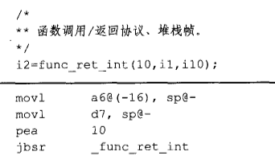

前三条指令把函数的参数压入堆栈。被压入的第1个参数存储于a6@(-16)，包含变量i10。然后被压入的是d7，包含变量i1。

pea指令简单地把它的操作数压入堆栈。

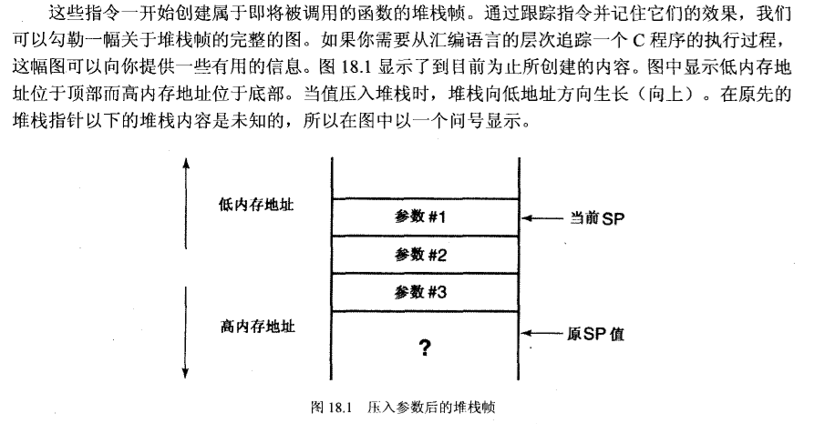

jbsr是跳转子程序(jump subroutine)。它把返回地址压入堆栈，并跳转到_func_ret_int 的起始位置。当被调用函数结束仍无后需要返回到它的调用位置，就要用到这个压入到堆栈中的返回地址。

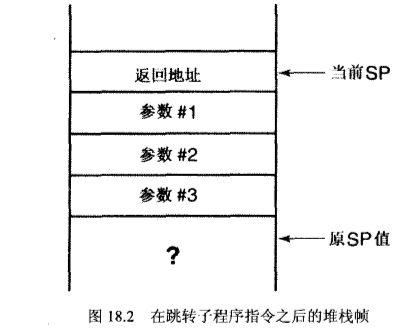

#### 函数序

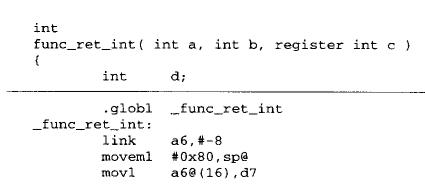

首先，a6的内容被压入栈中。其次，堆栈指针的当前值被复制到a6

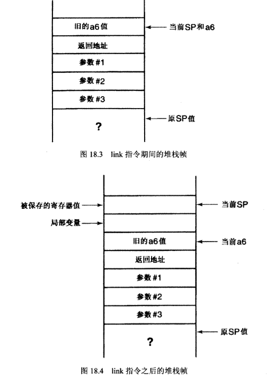

最后，link指令从堆栈指针中-8。这将会创建空间用于保存局部变量和被保存的寄存器值。

下一条指令把一个单一的寄存器保存到堆栈帧。 0x80指定寄存器d7。寄存器存储在堆栈的顶部，它提示堆栈帧的顶部就是寄存器值保存的位置。堆栈帧剩余的部分必然是局部变量存储的地方。

最后(mov指令) 从堆栈复制一个值到d7。

#### 堆栈中的参数顺序

被调用函数使用帧指针加一个偏移量来访问参数。当参数以反序压入到堆栈时，参数列表的第1个参数便位于堆栈中这些参数的顶部，它距离帧指针的偏移量是个常数。

#### 最终的堆栈帧布局

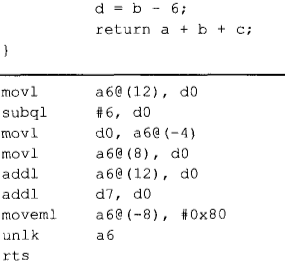

第1条movl指令是把第2个参数复制到d0。下一条指令将这个值-6，第3条指令把结果存入局部变量d。d0的作用是计算过程中的"中间结果暂存器"。

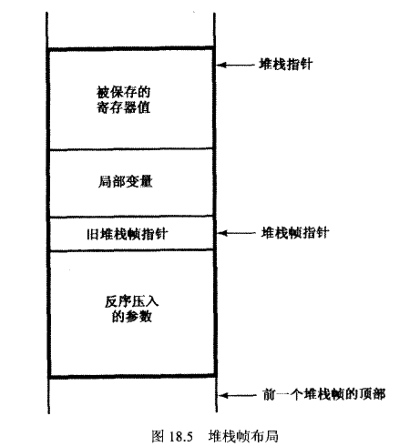

接下来的3条指令对return语句进行求值。结果存入d0。

#### 函数跋


当返回到调用程序之后执行的第1条指令就是把12加到堆栈指针。这个假发能把参数值从堆栈中取出。

#### 返回值


这个函数没有参数，所以没有东西压入堆栈。这个函数返回后，d0和d1的值都被保存。double的长度为8，返回需要同时用到d0和d1。

## 18.2C和汇编语言的接口

#### 汇编语言程序调用C

1.如果寄存器d0、d1、a0、a1保存了重要的值，它们必须在调用C之前进行保存，因为C不会保存它们的值。

2.任何函数的参数必须以参数列表相反的顺序压入到堆栈中。

3.函数必须由一条"跳转子程序"类型的指令调用，它会把返回地址压入堆栈。

4.当C函数返回时，汇编程序必须清楚堆栈中的任何参数。

5.如果汇编程序期望接受一个返回值，它将保存在d0。

6.任何在调用之前进行过保存的寄存器此时可以恢复。

#### C调用汇编程序

1.保存任何你希望修改的寄存器(除了d0、d1、a0、a1)。

2.参数值从堆栈中获得，因为调用它的C函数把参数压入堆栈。

3.如果函数应该返回一个值，它的值应保存在d0中。

4.返回之前，函数必须清楚任何它压入堆栈中的内容。

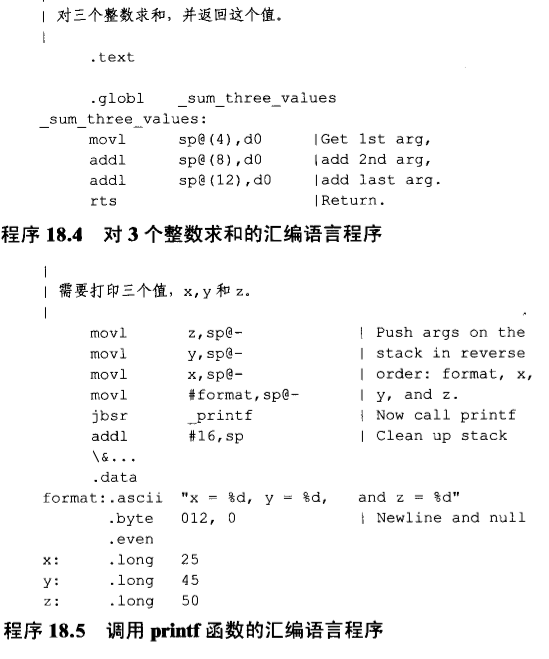

## 18.3运行时效率

虚拟内存：由操作系统实现，它在需要时把程序的活动部分放入内存并把不活动的部分复制到磁盘中，这样就允许运行大型的程序。

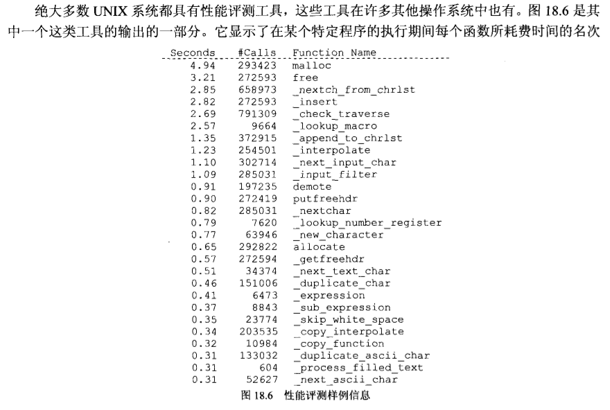

1.在耗费时间最多的函数中，有些是库函数。

2.有些函数之所以耗费了大量的实践是因为它们被调用的次数多。

3.有些函数调用的次数并不多，但是每次调用所花费的时间很长。

## 警告的总结

1.决定 外部标识符最大长度 的是链接器而不是编译器。

2.你无法链接由不同编译器产生的程序。


## 编程提示总结

1.使用stdarg实现可变参数列表。

2.改进算法比优化代码更有效率。

3.使用某种环境特有的技巧会导致程序不可移植。


